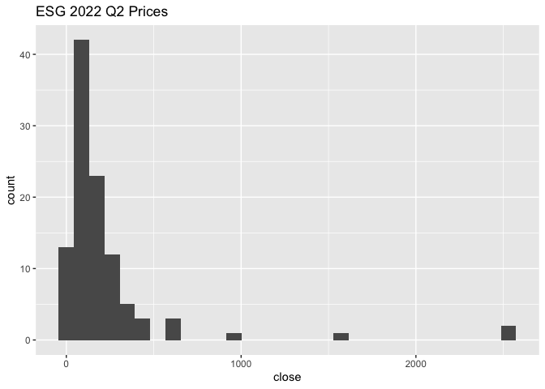
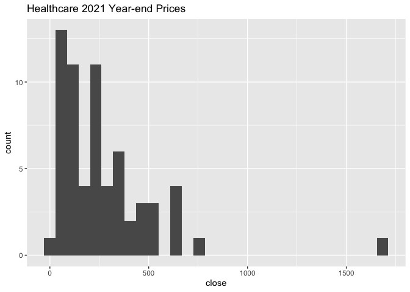
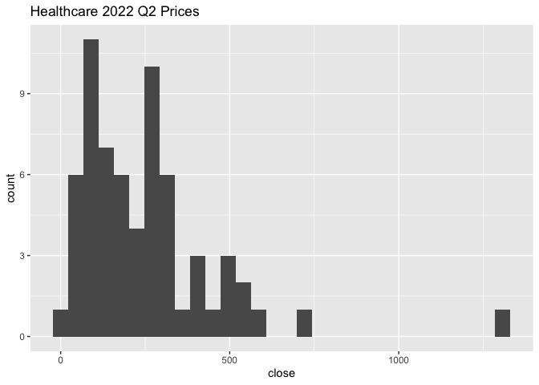
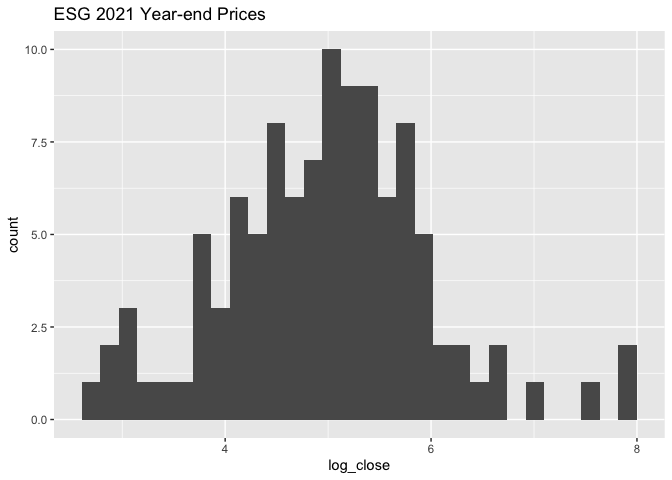
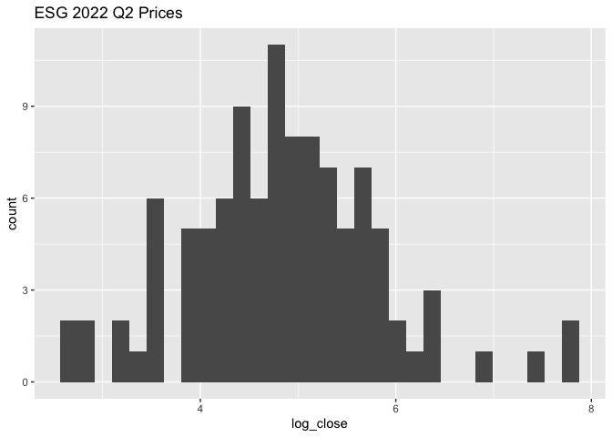
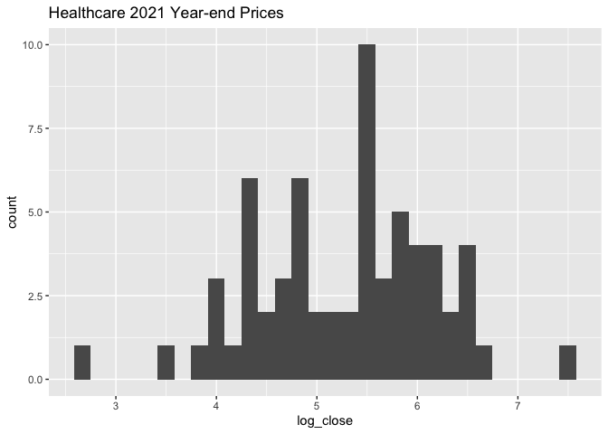
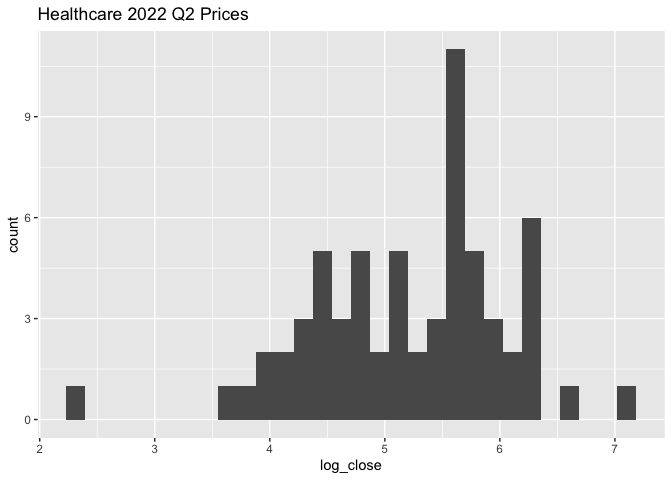

DSC 503 Statistical Analysis: Final Project
================
Michael Albers

## Project Overview

Conduct a ANOVA analysis with multiple levels for two sectors of stocks
which are ESG (Environmental Social Governance) and Health Care.

## Research Question

This analysis will attempt to answer the question of whether an
investment portfolio can benefit from a combination of ESG and
Healthcare stocks. The assumption is that differences in fundamental
ratios among these two groups may lead to different price movements
among the two independent variables which can bring diversification to
an investor. This analysis does not attempt to predict future returns
but rather it attempts to answer whether Healthcare stocks and ESG
stocks are to be considered together as a diversification strategy.

## Dataset

The pricing data for 12/31/2021 and for 4/14/2022 was accessed via an
API call to the polygon.io site. The fundamental data including
financial ratios and performance metrics for each stock was accessed via
an API call to the Alpha Vantage site.

## Load pricing data files

``` r
esg_ye_prices <- read.csv('data/ESG_prices_20211231.csv')
```

``` r
esg_2022_q2_prices <- read.csv('data/ESG_prices_20220414.csv')
```

``` r
healthcare_ye_prices <- read.csv('data/Healthcare_prices_20211231.csv')
```

``` r
healthcare_q2_prices <- read.csv('data/Healthcare_prices_20220414.csv')
```

## Scale stock prices

The prices among the individual ESG and Healthcare stocks will vary
significantly based on market conditions and the specific industry of
the stock. It is very likely that the stock prices will be right-skewed.

The 2021 year-end and 2022 Q2 prices for each stock will be normalized
by taking the log of the prices which is known as log normalization.
Then the difference of the two log prices will be calculated for each
stock to derive a new feature representing the gain/loss of the stock
between 2021 year-end and the April 2022 price. The new price gain loss
feature for ESG and Healthcare stocks should then approximate a normal
distribution.

### Histogram of prices (before log normalization)

``` r
ggplot(esg_ye_prices, aes(x=close)) +
  geom_histogram(bins = 30) +
  ggtitle("ESG 2021 Year-end Prices")
```

<!-- -->

``` r
ggplot(esg_2022_q2_prices, aes(x=close)) +
  geom_histogram(bins = 30) +
  ggtitle("ESG 2022 Q2 Prices")
```

<!-- -->

``` r
ggplot(healthcare_ye_prices, aes(x=close)) +
  geom_histogram(bins = 30) +
  ggtitle("Healthcare 2021 Year-end Prices")
```

<!-- -->

``` r
ggplot(healthcare_q2_prices, aes(x=close)) +
  geom_histogram(bins = 30) +
  ggtitle("Healthcare 2022 Q2 Prices")
```

<!-- -->

All four histograms for the ESG and Healthcare stock prices are skewed
to the right. A log normalization on the prices will be done to scale
the prices so that they approximate a normal distribution.

``` r
esg_ye_prices$log_close <- log(esg_ye_prices$close)
esg_2022_q2_prices$log_close <- log(esg_2022_q2_prices$close)
healthcare_ye_prices$log_close <- log(healthcare_ye_prices$close)
healthcare_q2_prices$log_close <- log(healthcare_q2_prices$close)
```

### Histogram of prices (after log normalization)

``` r
ggplot(esg_ye_prices, aes(x=log_close)) +
  geom_histogram(bins = 30) +
  ggtitle("ESG 2021 Year-end Prices")
```

<!-- -->

``` r
ggplot(esg_2022_q2_prices, aes(x=log_close)) +
  geom_histogram(bins = 30) +
  ggtitle("ESG 2022 Q2 Prices")
```

<!-- -->

``` r
ggplot(healthcare_ye_prices, aes(x=log_close)) +
  geom_histogram(bins = 30) +
  ggtitle("Healthcare 2021 Year-end Prices")
```

<!-- -->

``` r
ggplot(healthcare_q2_prices, aes(x=log_close)) +
  geom_histogram(bins = 30) +
  ggtitle("Healthcare 2022 Q2 Prices")
```

<!-- -->

The prices for ESG and Healthcare stocks more closely follows a normal
distribution after applying a log normalization to the close price.

## Create new price gain/loss feature

The next step is to calculate a new feature for price gain/loss for each
ESG and Healthcare stock. The new price gain/loss feature will be the
response variable for the ANOVA factor analysis.

``` r
esg_price_diff <- merge(esg_2022_q2_prices, esg_ye_prices, by.x = 'ticker', by.y = 'ticker') %>%
  select(ticker, log_close.x, log_close.y) %>%
  mutate(log_price_gain_loss = log_close.x-log_close.y)
```

``` r
esg_price_diff$sector <- "ESG"
```

``` r
healthcare_price_diff <- merge(healthcare_q2_prices, healthcare_ye_prices, by.x = 'ticker', by.y = 'ticker') %>%
  select(ticker, log_close.x, log_close.y) %>%
  mutate(log_price_gain_loss = log_close.x-log_close.y)
```

``` r
healthcare_price_diff$sector <- "HC"
```

``` r
stock_prices_gain_loss <- rbind(healthcare_price_diff, esg_price_diff)
```

``` r
duplicate_tickers <- stock_prices_gain_loss[duplicated(stock_prices_gain_loss$ticker),]
```

``` r
duplicate_tickers
```

    ##     ticker log_close.x log_close.y log_price_gain_loss sector
    ## 65       A    4.839768    5.072984        -0.233216032    ESG
    ## 68     ABT    4.768054    4.946914        -0.178860168    ESG
    ## 98     DHR    5.623945    5.796088        -0.172142844    ESG
    ## 114   HOLX    4.335066    4.338075        -0.003008701    ESG
    ## 119    JNJ    5.192401    5.142073         0.050328311    ESG
    ## 123    LLY    5.709963    5.621198         0.088765684    ESG
    ## 154    TMO    6.343705    6.503150        -0.159445130    ESG
    ## 169    ZTS    5.232712    5.497291        -0.264579559    ESG

``` r
# remove duplicate tickers from ESG price diff data frame
esg_price_diff_new <- anti_join(esg_price_diff, duplicate_tickers, by="ticker")
```

``` r
stock_prices_gain_loss <- rbind(healthcare_price_diff, esg_price_diff_new)
```

``` r
# check for duplicate tickers
stock_prices_gain_loss[duplicated(stock_prices_gain_loss$ticker),] %>% count()
```

    ##   n
    ## 1 0

``` r
# take subset of columns 
stock_prices_gain_loss <- subset(stock_prices_gain_loss, select = c(ticker, log_price_gain_loss, sector))
```

``` r
str(stock_prices_gain_loss)
```

    ## 'data.frame':    161 obs. of  3 variables:
    ##  $ ticker             : chr  "A" "ABBV" "ABC" "ABMD" ...
    ##  $ log_price_gain_loss: num  -0.233 0.181 0.193 -0.16 -0.179 ...
    ##  $ sector             : chr  "HC" "HC" "HC" "HC" ...

## Load ESG and Healthcare company information files

The company information including fundamental ratios for each stock will
be loaded into data frames for both ESG and Healthcare groups.

``` r
esg_company_info <- read.csv('data/ESG_company_information.csv')
```

``` r
colnames(esg_company_info)[1] <- "Symbol"
```

``` r
str(esg_company_info)
```

    ## 'data.frame':    105 obs. of  47 variables:
    ##  $ Symbol                    : chr  "A" "AAPL" "ABG" "ABT" ...
    ##  $ AssetType                 : chr  "Common Stock" "Common Stock" "Common Stock" "Common Stock" ...
    ##  $ Name                      : chr  "Agilent Technologies Inc" "Apple Inc" "Asbury Automotive Group Inc" "Abbott Laboratories" ...
    ##  $ Description               : chr  "Agilent Technologies, Inc. is an American analytical instrumentation development and manufacturing company that"| __truncated__ "Apple Inc. is an American multinational technology company that specializes in consumer electronics, computer s"| __truncated__ "Asbury Automotive Group, Inc. is an automobile retailer in the United States. The company is headquartered in Duluth, Georgia." "Abbott Laboratories is an American multinational medical devices and health care company with headquarters in A"| __truncated__ ...
    ##  $ CIK                       : int  1090872 320193 1144980 1800 1467373 796343 1042046 6951 2488 820027 ...
    ##  $ Exchange                  : chr  "NYSE" "NASDAQ" "NYSE" "NYSE" ...
    ##  $ Currency                  : chr  "USD" "USD" "USD" "USD" ...
    ##  $ Country                   : chr  "USA" "USA" "USA" "USA" ...
    ##  $ Sector                    : chr  "LIFE SCIENCES" "TECHNOLOGY" "TRADE & SERVICES" "LIFE SCIENCES" ...
    ##  $ Industry                  : chr  "INSTRUMENTS FOR MEAS & TESTING OF ELECTRICITY & ELEC SIGNALS" "ELECTRONIC COMPUTERS" "RETAIL-AUTO DEALERS & GASOLINE STATIONS" "PHARMACEUTICAL PREPARATIONS" ...
    ##  $ Address                   : chr  "5301 STEVENS CREEK BLVD, SANTA CLARA, CA, US" "ONE INFINITE LOOP, CUPERTINO, CA, US" "2905 PREMIERE PARKWAY NW, SUITE 300, DULUTH, GA, US" "100 ABBOTT PARK ROAD, ABBOTT PARK, IL, US" ...
    ##  $ FiscalYearEnd             : chr  "October" "September" "December" "December" ...
    ##  $ LatestQuarter             : int  44592 44651 44651 44651 44620 44620 44561 44592 44561 44651 ...
    ##  $ MarketCapitalization      : num  3.58e+10 2.58e+12 4.36e+09 1.99e+11 1.93e+11 ...
    ##  $ EBITDA                    : chr  "1787000000" "1.28218E+11" "833200000" "12756000000" ...
    ##  $ PERatio                   : chr  "30.26" "26.26" "7.09" "28.64" ...
    ##  $ PEGRatio                  : chr  "2.383" "3.031" "0.881" "6.87" ...
    ##  $ BookValue                 : num  17.2 4.4 110.1 20.3 32.5 ...
    ##  $ DividendPerShare          : num  0.792 0.865 0 1.82 3.79 0 2.06 0.96 0 4.43 ...
    ##  $ DividendYield             : num  0.007 0.0058 0 0.0166 0.0129 0 0.0162 0.0089 0 0.0183 ...
    ##  $ EPS                       : num  3.94 6.01 26.49 3.94 9.92 ...
    ##  $ RevenuePerShareTTM        : num  21.3 22.8 494.4 24.3 89.5 ...
    ##  $ ProfitMargin              : num  0.187 0.266 0.0541 0.164 0.113 0.299 0.312 0.271 0.192 0.205 ...
    ##  $ OperatingMarginTTM        : num  0.227 0.309 0.0804 0.214 0.151 0.367 0.225 0.321 0.222 0.311 ...
    ##  $ ReturnOnAssetsTTM         : num  0.0912 0.199 0.0847 0.078 0.127 0.145 0.0175 0.199 0.213 0.0153 ...
    ##  $ ReturnOnEquityTTM         : num  0.242 1.456 0.352 0.205 0.324 ...
    ##  $ RevenueTTM                : num  6.44e+09 3.78e+11 9.84e+09 4.31e+10 5.67e+10 ...
    ##  $ GrossProfitTTM            : num  3.41e+09 1.53e+11 1.90e+09 2.50e+10 1.64e+10 ...
    ##  $ DilutedEPSTTM             : num  3.94 6.01 26.49 3.94 9.92 ...
    ##  $ QuarterlyEarningsGrowthYOY: num  0 0.25 0.402 -0.075 0.139 ...
    ##  $ QuarterlyRevenueGrowthYOY : num  0.081 0.112 0.188 0.072 0.245 0.091 0.04 0.215 0.488 0.18 ...
    ##  $ AnalystTargetPrice        : num  173 192 244 142 381 ...
    ##  $ TrailingPE                : chr  "30.26" "26.26" "7.09" "28.64" ...
    ##  $ ForwardPE                 : chr  "24.63" "26.11" "5.46" "23.42" ...
    ##  $ PriceToSalesRatioTTM      : num  5.55 6.81 0.443 4.619 3.406 ...
    ##  $ PriceToBookRatio          : chr  "6.95" "35.77" "2.014" "5.59" ...
    ##  $ EVToRevenue               : chr  "5.8" "6.82" "0.747" "4.693" ...
    ##  $ EVToEBITDA                : chr  "21.03" "19.99" "8.08" "18" ...
    ##  $ Beta                      : num  1.052 1.188 1.395 0.734 1.235 ...
    ##  $ X52WeekHigh               : num  179 183 231 142 415 ...
    ##  $ X52WeekLow                : num  116 122 146 104 274 ...
    ##  $ X50DayMovingAverage       : num  131 166 175 119 321 ...
    ##  $ X200DayMovingAverage      : num  150 159 180 125 342 ...
    ##  $ SharesOutstanding         : num  3.00e+08 1.63e+10 2.32e+07 1.76e+09 6.33e+08 ...
    ##  $ DividendDate              : chr  "44678" "44693" "39682" "44697" ...
    ##  $ ExDividendDate            : chr  "44655" "44687" "39659" "44664" ...
    ##  $ Note                      : logi  NA NA NA NA NA NA ...

``` r
healthcare_company_info <- read.csv('data/Healthcare_company_information.csv')
```

``` r
str(healthcare_company_info)
```

    ## 'data.frame':    64 obs. of  46 variables:
    ##  $ Symbol                    : chr  "A" "ABBV" "ABC" "ABMD" ...
    ##  $ AssetType                 : chr  "Common Stock" "Common Stock" "Common Stock" "Common Stock" ...
    ##  $ Name                      : chr  "Agilent Technologies Inc" "AbbVie Inc" "AmerisourceBergen Corporation" "Abiomed Inc" ...
    ##  $ Description               : chr  "Agilent Technologies, Inc. is an American analytical instrumentation development and manufacturing company that"| __truncated__ "AbbVie is an American publicly traded biopharmaceutical company founded in 2013. It originated as a spin-off of"| __truncated__ "AmerisourceBergen Corporation is an American drug wholesale company that was formed by the merger of Bergen Bru"| __truncated__ "Abiomed is a publicly-traded medical devices company that develops and manufactures external and implantable ci"| __truncated__ ...
    ##  $ CIK                       : int  1090872 1551152 1140859 815094 1800 1097149 318154 1156039 10456 10795 ...
    ##  $ Exchange                  : chr  "NYSE" "NYSE" "NYSE" "NASDAQ" ...
    ##  $ Currency                  : chr  "USD" "USD" "USD" "USD" ...
    ##  $ Country                   : chr  "USA" "USA" "USA" "USA" ...
    ##  $ Sector                    : chr  "LIFE SCIENCES" "LIFE SCIENCES" "TRADE & SERVICES" "LIFE SCIENCES" ...
    ##  $ Industry                  : chr  "INSTRUMENTS FOR MEAS & TESTING OF ELECTRICITY & ELEC SIGNALS" "PHARMACEUTICAL PREPARATIONS" "WHOLESALE-DRUGS, PROPRIETARIES & DRUGGISTS' SUNDRIES" "SURGICAL & MEDICAL INSTRUMENTS & APPARATUS" ...
    ##  $ Address                   : chr  "5301 STEVENS CREEK BLVD, SANTA CLARA, CA, US" "1 NORTH WAUKEGAN ROAD, NORTH CHICAGO, IL, US" "1300 MORRIS DRIVE, CHESTERBROOK, PA, US" "22 CHERRY HILL DRIVE, DANVERS, MA, UNITED STATES" ...
    ##  $ FiscalYearEnd             : chr  "October" "December" "September" "March" ...
    ##  $ LatestQuarter             : chr  "2022-01-31" "2021-12-31" "2021-12-31" "2022-03-31" ...
    ##  $ MarketCapitalization      : num  3.58e+10 2.59e+11 3.16e+10 1.30e+10 1.99e+11 ...
    ##  $ EBITDA                    : num  1.79e+09 2.80e+10 3.35e+09 2.81e+08 1.28e+10 ...
    ##  $ PERatio                   : chr  "30.26" "22.77" "19.62" "98.52" ...
    ##  $ PEGRatio                  : chr  "2.383" "1.279" "1.691" "2.75" ...
    ##  $ BookValue                 : num  17.16 8.71 1.16 31.48 20.3 ...
    ##  $ DividendPerShare          : num  0.792 5.31 1.78 0 1.82 ...
    ##  $ DividendYield             : num  0.007 0.0384 0.0117 0 0.0166 0 0.0333 0.0099 0.0158 0.0141 ...
    ##  $ EPS                       : num  3.94 6.45 7.71 2.91 3.94 ...
    ##  $ RevenuePerShareTTM        : num  21.3 31.8 1068.7 22.1 24.3 ...
    ##  $ ProfitMargin              : num  0.187 0.205 0.0073 0.133 0.164 0.195 0.227 0.044 0.1 0.0886 ...
    ##  $ OperatingMarginTTM        : num  0.227 0.347 0.0125 0.253 0.214 0.247 0.359 0.0646 0.164 0.15 ...
    ##  $ ReturnOnAssetsTTM         : num  0.0912 0.0822 0.0335 0.105 0.078 0.113 0.0941 0.0608 0.0488 0.0346 ...
    ##  $ ReturnOnEquityTTM         : num  0.242 0.809 0.361 0.0988 0.205 0.225 0.732 0.176 0.145 0.0723 ...
    ##  $ RevenueTTM                : num  6.44e+09 5.62e+10 2.21e+11 1.00e+09 4.31e+10 ...
    ##  $ GrossProfitTTM            : num  3.41e+09 3.89e+10 6.77e+09 6.86e+08 2.50e+10 ...
    ##  $ DilutedEPSTTM             : num  3.94 6.45 7.71 2.91 3.94 ...
    ##  $ QuarterlyEarningsGrowthYOY: num  0 248.9 0.177 -0.259 -0.075 ...
    ##  $ QuarterlyRevenueGrowthYOY : num  0.081 0.074 0.135 0.127 0.072 0.236 0.032 0.15 0.105 -0.06 ...
    ##  $ AnalystTargetPrice        : num  173 164 167 354 142 ...
    ##  $ TrailingPE                : chr  "30.26" "22.77" "19.62" "98.52" ...
    ##  $ ForwardPE                 : chr  "24.63" "10.41" "14.04" "-" ...
    ##  $ PriceToSalesRatioTTM      : num  5.55 4.617 0.143 13 4.619 ...
    ##  $ PriceToBookRatio          : num  6.95 16.84 130.99 8.68 5.59 ...
    ##  $ EVToRevenue               : num  5.8 5.81 0.159 12.25 4.693 ...
    ##  $ EVToEBITDA                : chr  "21.03" "13.63" "11.39" "43.55" ...
    ##  $ Beta                      : chr  "1.052" "0.785" "0.464" "1.325" ...
    ##  $ X52WeekHigh               : num  179 174 167 379 142 ...
    ##  $ X52WeekLow                : num  116 102 110 261 104 ...
    ##  $ X50DayMovingAverage       : num  131 156 152 307 119 ...
    ##  $ X200DayMovingAverage      : num  150 130 132 327 125 ...
    ##  $ SharesOutstanding         : num  3.00e+08 1.77e+09 2.09e+08 4.55e+07 1.76e+09 ...
    ##  $ DividendDate              : chr  "2022-04-27" "2022-05-16" "2022-02-28" "None" ...
    ##  $ ExDividendDate            : chr  "2022-04-04" "2022-04-14" "2022-02-11" "None" ...

## Extract fundamentals from ESG and Healthcare company information data frames

For the ESG and Healthcare stocks, the profit margin, operating margin,
return on equity, return on assets, and beta will be extracted. All
columns except the Beta fall within zero and one. The beta column which
is a measure of volatility will be scaled between zero and one.

``` r
extract_company_info.f <- function(df) {
  subset_df <- subset(df, select=c(Symbol, 
                                   ProfitMargin, 
                                   OperatingMarginTTM,
                                   ReturnOnAssetsTTM,
                                   ReturnOnEquityTTM,
                                   Beta ))
}
```

``` r
zero_one_func <- function(x) {
  (x - min(x)) / (max(x) - min(x))
}
```

``` r
esg.df <- extract_company_info.f(esg_company_info)
```

``` r
str(esg.df)
```

    ## 'data.frame':    105 obs. of  6 variables:
    ##  $ Symbol            : chr  "A" "AAPL" "ABG" "ABT" ...
    ##  $ ProfitMargin      : num  0.187 0.266 0.0541 0.164 0.113 0.299 0.312 0.271 0.192 0.205 ...
    ##  $ OperatingMarginTTM: num  0.227 0.309 0.0804 0.214 0.151 0.367 0.225 0.321 0.222 0.311 ...
    ##  $ ReturnOnAssetsTTM : num  0.0912 0.199 0.0847 0.078 0.127 0.145 0.0175 0.199 0.213 0.0153 ...
    ##  $ ReturnOnEquityTTM : num  0.242 1.456 0.352 0.205 0.324 ...
    ##  $ Beta              : num  1.052 1.188 1.395 0.734 1.235 ...

``` r
healthcare.df <- extract_company_info.f(healthcare_company_info)
```

``` r
str(healthcare.df)
```

    ## 'data.frame':    64 obs. of  6 variables:
    ##  $ Symbol            : chr  "A" "ABBV" "ABC" "ABMD" ...
    ##  $ ProfitMargin      : num  0.187 0.205 0.0073 0.133 0.164 0.195 0.227 0.044 0.1 0.0886 ...
    ##  $ OperatingMarginTTM: num  0.227 0.347 0.0125 0.253 0.214 0.247 0.359 0.0646 0.164 0.15 ...
    ##  $ ReturnOnAssetsTTM : num  0.0912 0.0822 0.0335 0.105 0.078 0.113 0.0941 0.0608 0.0488 0.0346 ...
    ##  $ ReturnOnEquityTTM : num  0.242 0.809 0.361 0.0988 0.205 0.225 0.732 0.176 0.145 0.0723 ...
    ##  $ Beta              : chr  "1.052" "0.785" "0.464" "1.325" ...

``` r
healthcare.df$Beta <- ifelse(is.na(healthcare.df$Beta),0,healthcare.df$Beta)
```

``` r
esg.df$beta_scaled <- zero_one_func(esg.df$Beta)
```

``` r
healthcare.df$beta_scaled <- zero_one_func(healthcare.df$Beta)
```

``` r
head(esg.df)
```

    ##   Symbol ProfitMargin OperatingMarginTTM ReturnOnAssetsTTM ReturnOnEquityTTM
    ## 1      A       0.1870             0.2270            0.0912             0.242
    ## 2   AAPL       0.2660             0.3090            0.1990             1.456
    ## 3    ABG       0.0541             0.0804            0.0847             0.352
    ## 4    ABT       0.1640             0.2140            0.0780             0.205
    ## 5    ACN       0.1130             0.1510            0.1270             0.324
    ## 6   ADBE       0.2990             0.3670            0.1450             0.353
    ##    Beta beta_scaled
    ## 1 1.052   0.3833500
    ## 2 1.188   0.4511466
    ## 3 1.395   0.5543370
    ## 4 0.734   0.2248255
    ## 5 1.235   0.4745763
    ## 6 1.048   0.3813559

``` r
head(healthcare.df)
```

    ##   Symbol ProfitMargin OperatingMarginTTM ReturnOnAssetsTTM ReturnOnEquityTTM
    ## 1      A       0.1870             0.2270            0.0912            0.2420
    ## 2   ABBV       0.2050             0.3470            0.0822            0.8090
    ## 3    ABC       0.0073             0.0125            0.0335            0.3610
    ## 4   ABMD       0.1330             0.2530            0.1050            0.0988
    ## 5    ABT       0.1640             0.2140            0.0780            0.2050
    ## 6   ALGN       0.1950             0.2470            0.1130            0.2250
    ##    Beta beta_scaled
    ## 1 1.052   0.6546360
    ## 2 0.785   0.4884879
    ## 3 0.464   0.2887368
    ## 4 1.325   0.8245177
    ## 5 0.734   0.4567517
    ## 6 1.606   0.9993777

## Create factors based on ranges of fundamentals

The factored ANOVA model will use factors as it’s explanatory variables
and the price gain/loss as the response variable.

The numeric columns for ProfitMargin, OperatingMarginTTM,
ReturnOnAssetsTTM, ReturnOnEquityTTM, and Beta_Scaled will be used to
create new factor columns. The new factor columns will have one of three
values (1 - Low, 2 - Mid, 3 - High).

### Create new ESG factor columns

``` r
create_fct_col.f <- function(col) {
  factor.col <- as.factor(ifelse(abs(col) <= 0.33, 1, 
                                     ifelse(abs(col) > 0.33 & abs(col) <= 0.66, 2,3)))
}
```

``` r
esg.df$ProfitMargin_factor <- create_fct_col.f(abs(esg.df$ProfitMargin))
esg.df$OperatingMargin_factor <- create_fct_col.f(abs(esg.df$OperatingMarginTTM))
esg.df$ReturnOnAssets_factor <- create_fct_col.f(abs(esg.df$ReturnOnAssetsTTM))
esg.df$ReturnOnEquity_factor <- create_fct_col.f(abs(esg.df$ReturnOnEquityTTM))
esg.df$Beta_factor <- create_fct_col.f(abs(esg.df$beta_scaled))
```

### Create new Healthcare factor columns

``` r
healthcare.df$ProfitMargin_factor <- create_fct_col.f(abs(healthcare.df$ProfitMargin))
healthcare.df$OperatingMargin_factor <- create_fct_col.f(abs(healthcare.df$OperatingMarginTTM))
healthcare.df$ReturnOnAssets_factor <- create_fct_col.f(abs(healthcare.df$ReturnOnAssetsTTM))
healthcare.df$ReturnOnEquity_factor <- create_fct_col.f(abs(healthcare.df$ReturnOnEquityTTM))
healthcare.df$Beta_factor <- create_fct_col.f(abs(healthcare.df$beta_scaled))
```

#### Remove duplicate stocks

Remove stocks that exist in both ESG and Healthcare data frames from ESG
data frame

``` r
esg.df.new <- anti_join(esg.df, duplicate_tickers, by=c("Symbol" = "ticker"))
```

#### Subset columns

``` r
esg_stock_info <- subset(esg.df.new, select=c("Symbol", 
                                              "ProfitMargin_factor",
                                              "OperatingMargin_factor",
                                              "ReturnOnAssets_factor",
                                              "ReturnOnEquity_factor",
                                              "Beta_factor"
                                              ))
```

``` r
str(esg_stock_info)
```

    ## 'data.frame':    97 obs. of  6 variables:
    ##  $ Symbol                : chr  "AAPL" "ABG" "ACN" "ADBE" ...
    ##  $ ProfitMargin_factor   : Factor w/ 3 levels "1","2","3": 1 1 1 1 1 1 1 1 1 1 ...
    ##  $ OperatingMargin_factor: Factor w/ 3 levels "1","2","3": 1 1 1 2 1 1 1 1 2 1 ...
    ##  $ ReturnOnAssets_factor : Factor w/ 2 levels "1","2": 1 1 1 1 1 1 1 1 1 1 ...
    ##  $ ReturnOnEquity_factor : Factor w/ 3 levels "1","2","3": 3 2 1 2 1 2 2 2 2 1 ...
    ##  $ Beta_factor           : Factor w/ 3 levels "1","2","3": 2 2 2 2 1 2 3 2 1 2 ...

``` r
healthcare_stock_info <- subset(healthcare.df, select=c("Symbol", 
                                              "ProfitMargin_factor",
                                              "OperatingMargin_factor",
                                              "ReturnOnAssets_factor",
                                              "ReturnOnEquity_factor",
                                              "Beta_factor"
                                              ))
```

``` r
str(healthcare_stock_info)
```

    ## 'data.frame':    64 obs. of  6 variables:
    ##  $ Symbol                : chr  "A" "ABBV" "ABC" "ABMD" ...
    ##  $ ProfitMargin_factor   : Factor w/ 3 levels "1","2","3": 1 1 1 1 1 1 1 1 1 1 ...
    ##  $ OperatingMargin_factor: Factor w/ 3 levels "1","2","3": 1 2 1 1 1 1 2 1 1 1 ...
    ##  $ ReturnOnAssets_factor : Factor w/ 2 levels "1","2": 1 1 1 1 1 1 1 1 1 1 ...
    ##  $ ReturnOnEquity_factor : Factor w/ 3 levels "1","2","3": 1 3 2 1 1 1 3 1 1 1 ...
    ##  $ Beta_factor           : Factor w/ 3 levels "1","2","3": 2 2 1 3 2 3 2 2 2 2 ...

``` r
stock_info.all <- rbind(esg_stock_info, healthcare_stock_info)
```

## Create input data frame for Anova model

``` r
stocks.clean <- merge(stock_prices_gain_loss, stock_info.all, by.x = "ticker", by.y = "Symbol") %>%
  select(ticker, log_price_gain_loss, sector, ProfitMargin_factor, OperatingMargin_factor, ReturnOnAssets_factor, ReturnOnEquity_factor, Beta_factor)
```

``` r
colnames(stocks.clean) <- c("ticker", "log_price_gain_loss", "sector",
                            "profit_margin", "operating_margin", "return_assets",
                            "return_equity", "beta")
```

``` r
stocks.clean$sector <- as.factor(stocks.clean$sector)
```

``` r
str(stocks.clean)
```

    ## 'data.frame':    161 obs. of  8 variables:
    ##  $ ticker             : chr  "A" "AAPL" "ABBV" "ABC" ...
    ##  $ log_price_gain_loss: num  -0.2332 -0.0717 0.1813 0.1932 -0.117 ...
    ##  $ sector             : Factor w/ 2 levels "ESG","HC": 2 1 2 2 1 2 2 1 1 1 ...
    ##  $ profit_margin      : Factor w/ 3 levels "1","2","3": 1 1 1 1 1 1 1 1 1 1 ...
    ##  $ operating_margin   : Factor w/ 3 levels "1","2","3": 1 1 2 1 1 1 1 1 2 1 ...
    ##  $ return_assets      : Factor w/ 2 levels "1","2": 1 1 1 1 1 1 1 1 1 1 ...
    ##  $ return_equity      : Factor w/ 3 levels "1","2","3": 1 3 3 2 2 1 1 1 2 1 ...
    ##  $ beta               : Factor w/ 3 levels "1","2","3": 2 2 2 1 2 3 2 2 2 1 ...

## Three-way ANOVA models

Three separate three-way ANOVA models will be created to determine if
the mean of the log_price_gain_loss dependent variable is different
between ESG and Healthcare stocks, and which factors may contribute to
the difference in means.

### ANOVA model 1:

**Dependent variable:** log_price_gain_loss

**Factors:**

-   sector (ESG = ESG stock; HC = Healthcare stock)

-   profit_margin

-   operating_margin

``` r
model_1 <- aov(log_price_gain_loss ~ sector*profit_margin*operating_margin, data=stocks.clean)
```

``` r
summary(model_1)
```

    ##                          Df Sum Sq Mean Sq F value  Pr(>F)   
    ## sector                    1  0.256 0.25645  10.007 0.00189 **
    ## profit_margin             2  0.173 0.08664   3.381 0.03662 * 
    ## operating_margin          2  0.004 0.00184   0.072 0.93085   
    ## sector:profit_margin      2  0.087 0.04360   1.701 0.18595   
    ## sector:operating_margin   2  0.090 0.04493   1.753 0.17672   
    ## Residuals               151  3.870 0.02563                   
    ## ---
    ## Signif. codes:  0 '***' 0.001 '**' 0.01 '*' 0.05 '.' 0.1 ' ' 1

### ANOVA model 2:

**Dependent variable:** log_price_gain_loss

**Factors:**

-   sector (ESG = ESG stock; HC = Healthcare stock)

-   return_assets

-   return_equity

``` r
model_2 <- aov(log_price_gain_loss ~ sector*return_assets*return_equity, data=stocks.clean)
```

``` r
summary(model_2)
```

    ##                       Df Sum Sq Mean Sq F value  Pr(>F)   
    ## sector                 1  0.256 0.25645   9.737 0.00216 **
    ## return_assets          1  0.102 0.10152   3.854 0.05143 . 
    ## return_equity          2  0.015 0.00731   0.278 0.75799   
    ## sector:return_assets   1  0.042 0.04187   1.590 0.20931   
    ## sector:return_equity   2  0.036 0.01801   0.684 0.50624   
    ## Residuals            153  4.030 0.02634                   
    ## ---
    ## Signif. codes:  0 '***' 0.001 '**' 0.01 '*' 0.05 '.' 0.1 ' ' 1

### ANOVA model 3:

**Dependent variable:** log_price_gain_loss

**Factors:**

-   sector (ESG = ESG stock; HC = Healthcare stock)

-   beta

``` r
model_3 <- aov(log_price_gain_loss ~ sector*beta, data=stocks.clean)
```

``` r
summary(model_3)
```

    ##              Df Sum Sq Mean Sq F value  Pr(>F)   
    ## sector        1  0.256 0.25645  10.695 0.00132 **
    ## beta          2  0.170 0.08502   3.546 0.03121 * 
    ## sector:beta   2  0.337 0.16854   7.029 0.00120 **
    ## Residuals   155  3.717 0.02398                   
    ## ---
    ## Signif. codes:  0 '***' 0.001 '**' 0.01 '*' 0.05 '.' 0.1 ' ' 1

## Findings

-   The sector factor was statistically significant in all ANOVA tests
    which means that sector contributes to the difference in variability
    in the log_price_gain_loss dependent variable among ESG and
    Healthcare stocks

-   Combination of sector and beta was statistically significant in
    explaining variance in the dependent variable

## Limitations

-   There were some outliers in the Healthcare stocks data which were
    present in the analysis. The outliers were not removed because the
    sample size for Healthcare stocks small.

-   The Alpha Vantage API for the company fundamental data only returned
    the latest available measures. As a result, the dataset had stock
    fundamentals from 2021 year-end as well as 2022 Q2. So the data was
    more current for some stocks as compared to other stocks in which
    the latest 2022 Q1 data was not available.

## References

**Stock Prices Data**

<https://polygon.io/docs/stocks/get_v2_aggs_ticker__stocksticker__range__multiplier___timespan___from___to>

**Company Information Data**

Company Overview. <https://www.alphavantage.co/documentation/>
