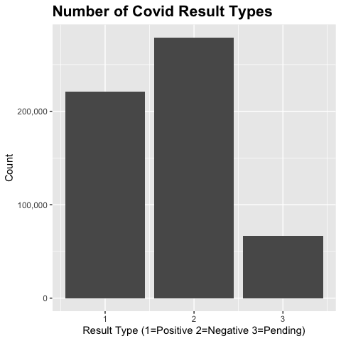
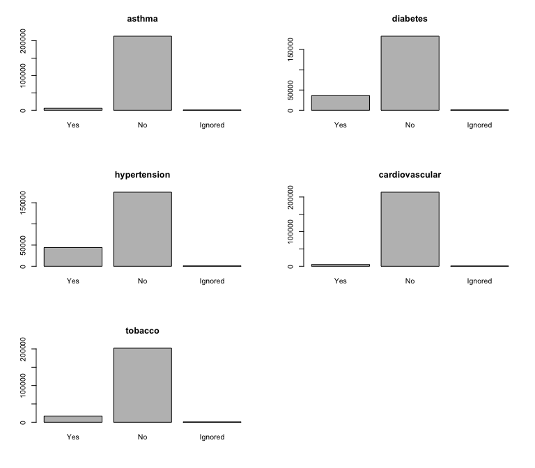
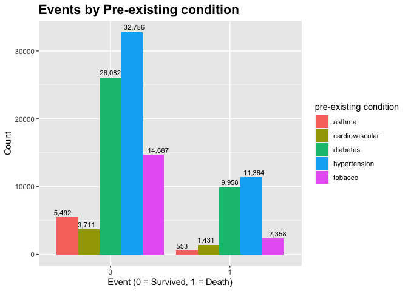
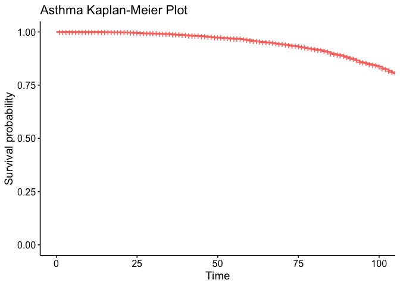
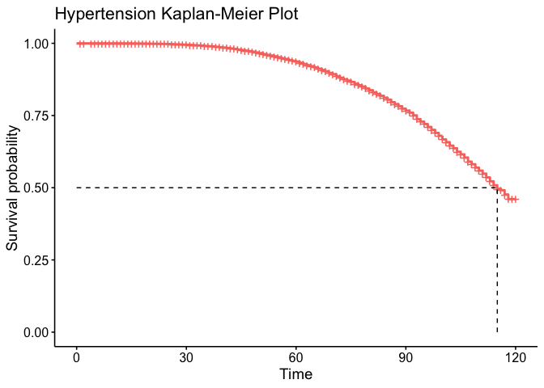
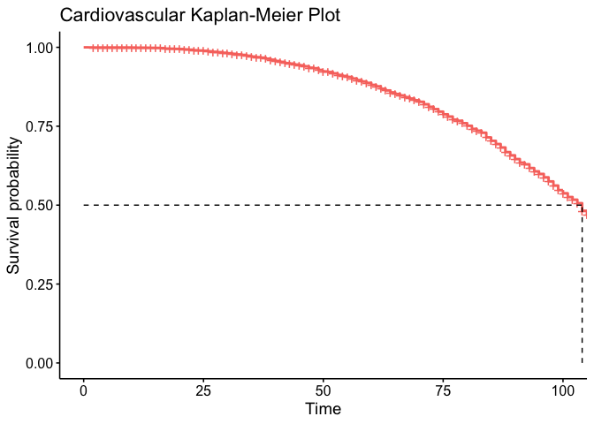
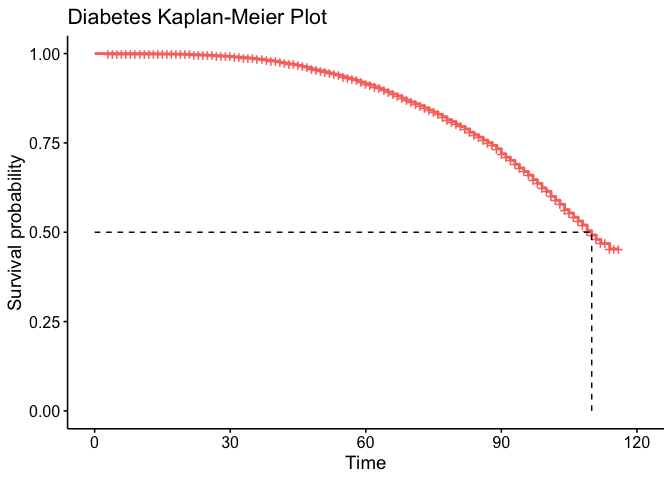
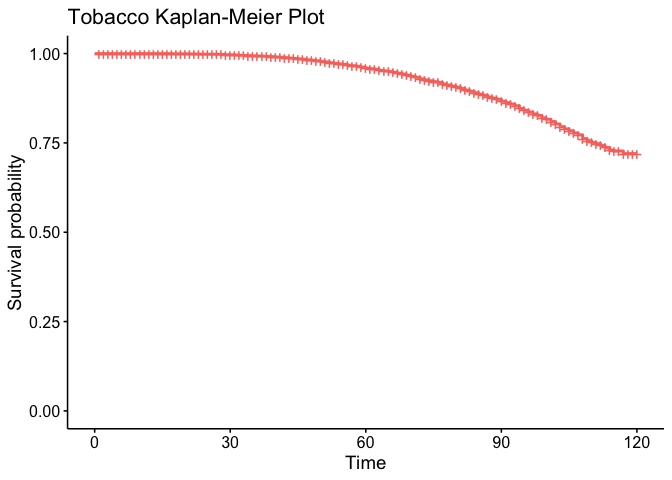

DSC 503 Statistical Analysis: Survival Analysis
================
2022-05-25

## Survival Analysis on COVID-19 pre-existing conditions

Use survival analysis to estimate the time to a death event for patients
diagnosed with COVID-19 who have pre-existing conditions for
hypertension, cardiovascular disease, asthma, diabetes, and tobacco use.
This analysis should indicate which of the five pre-existing conditions
have the shortest and longest time to death estimates.

## Data Set

The patient-level data for pre-existing conditions of COVID-19 is
sourced from Mexico’s
<a href="https://www.gob.mx/salud/documentos/datos-abiertos-152127">Open
Data General Directorate of Epidemiology</a> COVID-19 database. This
data set was downloaded from
<a href="https://www.kaggle.com/datasets/tanmoyx/covid19-patient-precondition-dataset">Kaggle</a>.

## Pre processing of Data

The raw dataset has over 566,000 records of patient data. The data set
will be filtered to include:

-   Patients with positive Covid test results
-   Date of symptoms between 01/01/2020 and 06/30/2020
-   Pre-existing conditions for asthma, hypertension, cardiovascular,
    diabetes, and tobacco use

``` r
covid_pre_condition <- read.csv('data/covid_pre_condition.csv')
```

``` r
str(covid_pre_condition)
```

    ## 'data.frame':    566602 obs. of  23 variables:
    ##  $ id                 : chr  "16169f" "1009bf" "167386" "0b5948" ...
    ##  $ sex                : int  2 2 1 2 1 2 2 1 1 1 ...
    ##  $ patient_type       : int  1 1 2 2 2 2 2 1 1 2 ...
    ##  $ entry_date         : chr  "04-05-2020" "19-03-2020" "06-04-2020" "17-04-2020" ...
    ##  $ date_symptoms      : chr  "02-05-2020" "17-03-2020" "01-04-2020" "10-04-2020" ...
    ##  $ date_died          : chr  "9999-99-99" "9999-99-99" "9999-99-99" "9999-99-99" ...
    ##  $ intubed            : int  97 97 2 2 2 2 2 97 97 1 ...
    ##  $ pneumonia          : int  2 2 2 1 2 1 2 2 2 1 ...
    ##  $ age                : int  27 24 54 30 60 47 63 56 41 39 ...
    ##  $ pregnancy          : int  97 97 2 97 2 97 97 2 2 2 ...
    ##  $ diabetes           : int  2 2 2 2 1 1 2 2 2 2 ...
    ##  $ copd               : int  2 2 2 2 2 2 2 2 2 2 ...
    ##  $ asthma             : int  2 2 2 2 2 2 2 2 2 2 ...
    ##  $ inmsupr            : int  2 2 2 2 2 2 2 2 2 2 ...
    ##  $ hypertension       : int  2 2 2 2 1 2 1 1 2 2 ...
    ##  $ other_disease      : int  2 2 2 2 2 2 2 2 2 2 ...
    ##  $ cardiovascular     : int  2 2 2 2 1 2 2 2 2 2 ...
    ##  $ obesity            : int  2 2 1 2 2 2 2 2 2 1 ...
    ##  $ renal_chronic      : int  2 2 2 2 2 2 2 1 2 2 ...
    ##  $ tobacco            : int  2 2 2 2 2 2 2 1 2 2 ...
    ##  $ contact_other_covid: int  2 99 99 99 99 99 99 1 99 99 ...
    ##  $ covid_res          : int  1 1 1 1 1 1 1 1 1 1 ...
    ##  $ icu                : int  97 97 2 2 2 1 2 97 97 2 ...

``` r
summary(covid_pre_condition)
```

    ##       id                 sex         patient_type    entry_date       
    ##  Length:566602      Min.   :1.000   Min.   :1.000   Length:566602     
    ##  Class :character   1st Qu.:1.000   1st Qu.:1.000   Class :character  
    ##  Mode  :character   Median :2.000   Median :1.000   Mode  :character  
    ##                     Mean   :1.507   Mean   :1.215                     
    ##                     3rd Qu.:2.000   3rd Qu.:1.000                     
    ##                     Max.   :2.000   Max.   :2.000                     
    ##  date_symptoms       date_died            intubed        pneumonia     
    ##  Length:566602      Length:566602      Min.   : 1.00   Min.   : 1.000  
    ##  Class :character   Class :character   1st Qu.:97.00   1st Qu.: 2.000  
    ##  Mode  :character   Mode  :character   Median :97.00   Median : 2.000  
    ##                                        Mean   :76.56   Mean   : 1.846  
    ##                                        3rd Qu.:97.00   3rd Qu.: 2.000  
    ##                                        Max.   :99.00   Max.   :99.000  
    ##       age           pregnancy       diabetes           copd      
    ##  Min.   :  0.00   Min.   : 1.0   Min.   : 1.000   Min.   : 1.00  
    ##  1st Qu.: 31.00   1st Qu.: 2.0   1st Qu.: 2.000   1st Qu.: 2.00  
    ##  Median : 41.00   Median :97.0   Median : 2.000   Median : 2.00  
    ##  Mean   : 42.62   Mean   :50.4   Mean   : 2.211   Mean   : 2.28  
    ##  3rd Qu.: 53.00   3rd Qu.:97.0   3rd Qu.: 2.000   3rd Qu.: 2.00  
    ##  Max.   :120.00   Max.   :98.0   Max.   :98.000   Max.   :98.00  
    ##      asthma          inmsupr       hypertension    other_disease  
    ##  Min.   : 1.000   Min.   : 1.00   Min.   : 1.000   Min.   : 1.00  
    ##  1st Qu.: 2.000   1st Qu.: 2.00   1st Qu.: 2.000   1st Qu.: 2.00  
    ##  Median : 2.000   Median : 2.00   Median : 2.000   Median : 2.00  
    ##  Mean   : 2.265   Mean   : 2.32   Mean   : 2.146   Mean   : 2.41  
    ##  3rd Qu.: 2.000   3rd Qu.: 2.00   3rd Qu.: 2.000   3rd Qu.: 2.00  
    ##  Max.   :98.000   Max.   :98.00   Max.   :98.000   Max.   :98.00  
    ##  cardiovascular      obesity       renal_chronic       tobacco      
    ##  Min.   : 1.000   Min.   : 1.000   Min.   : 1.000   Min.   : 1.000  
    ##  1st Qu.: 2.000   1st Qu.: 2.000   1st Qu.: 2.000   1st Qu.: 2.000  
    ##  Median : 2.000   Median : 2.000   Median : 2.000   Median : 2.000  
    ##  Mean   : 2.286   Mean   : 2.139   Mean   : 2.284   Mean   : 2.238  
    ##  3rd Qu.: 2.000   3rd Qu.: 2.000   3rd Qu.: 2.000   3rd Qu.: 2.000  
    ##  Max.   :98.000   Max.   :98.000   Max.   :98.000   Max.   :98.000  
    ##  contact_other_covid   covid_res          icu       
    ##  Min.   : 1.00       Min.   :1.000   Min.   : 1.00  
    ##  1st Qu.: 1.00       1st Qu.:1.000   1st Qu.:97.00  
    ##  Median : 2.00       Median :2.000   Median :97.00  
    ##  Mean   :31.57       Mean   :1.729   Mean   :76.56  
    ##  3rd Qu.:99.00       3rd Qu.:2.000   3rd Qu.:97.00  
    ##  Max.   :99.00       Max.   :3.000   Max.   :99.00

``` r
ggplot(data = covid_pre_condition, aes(covid_res)) +
  geom_bar() +
  ggtitle("Number of Covid Result Types") +
  scale_y_continuous(label=comma) +
  theme(plot.title = element_text(size=16, face="bold")) +
  labs(x="Result Type (1=Positive 2=Negative 3=Pending)", y="Count")
```

<!-- -->

### Filter for Positive cases

``` r
covid_positive <- covid_pre_condition %>%
  filter(covid_res == 1)
```

``` r
length(covid_positive$covid_res)
```

    ## [1] 220657

### Clean date_died column

The date_died column has values of 999-99-99 which means that the
patient is still alive. These values will be converted to NA

``` r
covid_positive[covid_positive["date_died"] == "9999-99-99", "date_died"] <- NA
```

``` r
str(covid_positive$date_died)
```

    ##  chr [1:220657] NA NA NA NA "22-04-2020" "29-04-2020" NA NA NA NA NA NA NA ...

### Convert date columns to date datatype

Use a regular expression pattern match to check that the dates are in
the correct format

``` r
entry_date.pattern <- grep("(\\d{2})-(\\d{2})-(\\d{4})", covid_positive$entry_date)
date_symptoms.pattern <- grep("(\\d{2})-(\\d{2})-(\\d{4})", covid_positive$date_symptoms)
date_died.pattern <- grep("(\\d{2})-(\\d{2})-(\\d{4})", covid_positive$date_died)
```

``` r
length(entry_date.pattern)
```

    ## [1] 220657

``` r
length(date_symptoms.pattern)
```

    ## [1] 220657

``` r
length(date_died.pattern)
```

    ## [1] 27121

``` r
# convert the date columns to a date datatype
covid_positive$entry_date <- as.Date(covid_positive$entry_date, "%d-%m-%y")
covid_positive$date_symptoms <- as.Date(covid_positive$date_symptoms, "%d-%m-%y")
covid_positive$date_died <- as.Date(covid_positive$date_died, "%d-%m-%y")
```

``` r
str(covid_positive)
```

    ## 'data.frame':    220657 obs. of  23 variables:
    ##  $ id                 : chr  "16169f" "1009bf" "167386" "0b5948" ...
    ##  $ sex                : int  2 2 1 2 1 2 2 1 1 1 ...
    ##  $ patient_type       : int  1 1 2 2 2 2 2 1 1 2 ...
    ##  $ entry_date         : Date, format: "2020-05-04" "2020-03-19" ...
    ##  $ date_symptoms      : Date, format: "2020-05-02" "2020-03-17" ...
    ##  $ date_died          : Date, format: NA NA ...
    ##  $ intubed            : int  97 97 2 2 2 2 2 97 97 1 ...
    ##  $ pneumonia          : int  2 2 2 1 2 1 2 2 2 1 ...
    ##  $ age                : int  27 24 54 30 60 47 63 56 41 39 ...
    ##  $ pregnancy          : int  97 97 2 97 2 97 97 2 2 2 ...
    ##  $ diabetes           : int  2 2 2 2 1 1 2 2 2 2 ...
    ##  $ copd               : int  2 2 2 2 2 2 2 2 2 2 ...
    ##  $ asthma             : int  2 2 2 2 2 2 2 2 2 2 ...
    ##  $ inmsupr            : int  2 2 2 2 2 2 2 2 2 2 ...
    ##  $ hypertension       : int  2 2 2 2 1 2 1 1 2 2 ...
    ##  $ other_disease      : int  2 2 2 2 2 2 2 2 2 2 ...
    ##  $ cardiovascular     : int  2 2 2 2 1 2 2 2 2 2 ...
    ##  $ obesity            : int  2 2 1 2 2 2 2 2 2 1 ...
    ##  $ renal_chronic      : int  2 2 2 2 2 2 2 1 2 2 ...
    ##  $ tobacco            : int  2 2 2 2 2 2 2 1 2 2 ...
    ##  $ contact_other_covid: int  2 99 99 99 99 99 99 1 99 99 ...
    ##  $ covid_res          : int  1 1 1 1 1 1 1 1 1 1 ...
    ##  $ icu                : int  97 97 2 2 2 1 2 97 97 2 ...

``` r
summary(covid_positive)
```

    ##       id                 sex         patient_type    entry_date        
    ##  Length:220657      Min.   :1.000   Min.   :1.00   Min.   :2020-01-13  
    ##  Class :character   1st Qu.:1.000   1st Qu.:1.00   1st Qu.:2020-05-14  
    ##  Mode  :character   Median :2.000   Median :1.00   Median :2020-05-31  
    ##                     Mean   :1.547   Mean   :1.31   Mean   :2020-05-26  
    ##                     3rd Qu.:2.000   3rd Qu.:2.00   3rd Qu.:2020-06-12  
    ##                     Max.   :2.000   Max.   :2.00   Max.   :2020-06-29  
    ##                                                                        
    ##  date_symptoms          date_died             intubed       pneumonia     
    ##  Min.   :2020-01-13   Min.   :2020-03-18   Min.   : 1.0   Min.   : 1.000  
    ##  1st Qu.:2020-05-10   1st Qu.:2020-05-12   1st Qu.: 2.0   1st Qu.: 2.000  
    ##  Median :2020-05-26   Median :2020-05-28   Median :97.0   Median : 2.000  
    ##  Mean   :2020-05-22   Mean   :2020-05-25   Mean   :67.6   Mean   : 1.761  
    ##  3rd Qu.:2020-06-08   3rd Qu.:2020-06-11   3rd Qu.:97.0   3rd Qu.: 2.000  
    ##  Max.   :2020-06-28   Max.   :2020-06-29   Max.   :99.0   Max.   :99.000  
    ##                       NA's   :193536                                      
    ##       age           pregnancy       diabetes           copd       
    ##  Min.   :  0.00   Min.   : 1.0   Min.   : 1.000   Min.   : 1.000  
    ##  1st Qu.: 34.00   1st Qu.: 2.0   1st Qu.: 2.000   1st Qu.: 2.000  
    ##  Median : 45.00   Median :97.0   Median : 2.000   Median : 2.000  
    ##  Mean   : 45.69   Mean   :54.3   Mean   : 2.207   Mean   : 2.315  
    ##  3rd Qu.: 57.00   3rd Qu.:97.0   3rd Qu.: 2.000   3rd Qu.: 2.000  
    ##  Max.   :120.00   Max.   :98.0   Max.   :98.000   Max.   :98.000  
    ##                                                                   
    ##      asthma          inmsupr        hypertension    other_disease   
    ##  Min.   : 1.000   Min.   : 1.000   Min.   : 1.000   Min.   : 1.000  
    ##  1st Qu.: 2.000   1st Qu.: 2.000   1st Qu.: 2.000   1st Qu.: 2.000  
    ##  Median : 2.000   Median : 2.000   Median : 2.000   Median : 2.000  
    ##  Mean   : 2.309   Mean   : 2.366   Mean   : 2.147   Mean   : 2.471  
    ##  3rd Qu.: 2.000   3rd Qu.: 2.000   3rd Qu.: 2.000   3rd Qu.: 2.000  
    ##  Max.   :98.000   Max.   :98.000   Max.   :98.000   Max.   :98.000  
    ##                                                                     
    ##  cardiovascular      obesity       renal_chronic       tobacco      
    ##  Min.   : 1.000   Min.   : 1.000   Min.   : 1.000   Min.   : 1.000  
    ##  1st Qu.: 2.000   1st Qu.: 2.000   1st Qu.: 2.000   1st Qu.: 2.000  
    ##  Median : 2.000   Median : 2.000   Median : 2.000   Median : 2.000  
    ##  Mean   : 2.335   Mean   : 2.159   Mean   : 2.325   Mean   : 2.295  
    ##  3rd Qu.: 2.000   3rd Qu.: 2.000   3rd Qu.: 2.000   3rd Qu.: 2.000  
    ##  Max.   :98.000   Max.   :98.000   Max.   :98.000   Max.   :98.000  
    ##                                                                     
    ##  contact_other_covid   covid_res      icu       
    ##  Min.   : 1.00       Min.   :1   Min.   : 1.00  
    ##  1st Qu.: 1.00       1st Qu.:1   1st Qu.: 2.00  
    ##  Median : 2.00       Median :1   Median :97.00  
    ##  Mean   :37.28       Mean   :1   Mean   :67.61  
    ##  3rd Qu.:99.00       3rd Qu.:1   3rd Qu.:97.00  
    ##  Max.   :99.00       Max.   :1   Max.   :99.00  
    ## 

### Take subset of pre-existing conditions

``` r
covid_positive <- subset(covid_positive, select = c(id, 
                                                    sex, 
                                                    patient_type, 
                                                    entry_date, 
                                                    date_symptoms,
                                                    date_died,
                                                    age,
                                                    asthma,
                                                    diabetes,
                                                    hypertension,
                                                    cardiovascular,
                                                    tobacco
                                                    ))
```

### Check for duplicate patient ids

``` r
# identify duplicate patient ids
covid_positive[duplicated(covid_positive$id),] %>% count()
```

    ##     n
    ## 1 773

There are 773 duplicate patient ids which will be removed.

``` r
# remove duplicate patient ids
covid_positive <- covid_positive[!duplicated(covid_positive$id),]
```

``` r
str(covid_positive)
```

    ## 'data.frame':    219884 obs. of  12 variables:
    ##  $ id            : chr  "16169f" "1009bf" "167386" "0b5948" ...
    ##  $ sex           : int  2 2 1 2 1 2 2 1 1 1 ...
    ##  $ patient_type  : int  1 1 2 2 2 2 2 1 1 2 ...
    ##  $ entry_date    : Date, format: "2020-05-04" "2020-03-19" ...
    ##  $ date_symptoms : Date, format: "2020-05-02" "2020-03-17" ...
    ##  $ date_died     : Date, format: NA NA ...
    ##  $ age           : int  27 24 54 30 60 47 63 56 41 39 ...
    ##  $ asthma        : int  2 2 2 2 2 2 2 2 2 2 ...
    ##  $ diabetes      : int  2 2 2 2 1 1 2 2 2 2 ...
    ##  $ hypertension  : int  2 2 2 2 1 2 1 1 2 2 ...
    ##  $ cardiovascular: int  2 2 2 2 1 2 2 2 2 2 ...
    ##  $ tobacco       : int  2 2 2 2 2 2 2 1 2 2 ...

## Create new feature called event

0 = survived, 1 = death

``` r
# create new event column from date_died column
covid_positive$event <- ifelse(is.na(covid_positive$date_died), 0, 1)
```

``` r
covid_positive$event <- as.factor(covid_positive$event)
```

``` r
str(covid_positive)
```

    ## 'data.frame':    219884 obs. of  13 variables:
    ##  $ id            : chr  "16169f" "1009bf" "167386" "0b5948" ...
    ##  $ sex           : int  2 2 1 2 1 2 2 1 1 1 ...
    ##  $ patient_type  : int  1 1 2 2 2 2 2 1 1 2 ...
    ##  $ entry_date    : Date, format: "2020-05-04" "2020-03-19" ...
    ##  $ date_symptoms : Date, format: "2020-05-02" "2020-03-17" ...
    ##  $ date_died     : Date, format: NA NA ...
    ##  $ age           : int  27 24 54 30 60 47 63 56 41 39 ...
    ##  $ asthma        : int  2 2 2 2 2 2 2 2 2 2 ...
    ##  $ diabetes      : int  2 2 2 2 1 1 2 2 2 2 ...
    ##  $ hypertension  : int  2 2 2 2 1 2 1 1 2 2 ...
    ##  $ cardiovascular: int  2 2 2 2 1 2 2 2 2 2 ...
    ##  $ tobacco       : int  2 2 2 2 2 2 2 1 2 2 ...
    ##  $ event         : Factor w/ 2 levels "0","1": 1 1 1 1 2 2 1 1 1 1 ...

``` r
summary(covid_positive)
```

    ##       id                 sex         patient_type    entry_date        
    ##  Length:219884      Min.   :1.000   Min.   :1.00   Min.   :2020-01-13  
    ##  Class :character   1st Qu.:1.000   1st Qu.:1.00   1st Qu.:2020-05-14  
    ##  Mode  :character   Median :2.000   Median :1.00   Median :2020-05-31  
    ##                     Mean   :1.547   Mean   :1.31   Mean   :2020-05-26  
    ##                     3rd Qu.:2.000   3rd Qu.:2.00   3rd Qu.:2020-06-12  
    ##                     Max.   :2.000   Max.   :2.00   Max.   :2020-06-29  
    ##                                                                        
    ##  date_symptoms          date_died               age             asthma      
    ##  Min.   :2020-01-13   Min.   :2020-03-18   Min.   :  0.00   Min.   : 1.000  
    ##  1st Qu.:2020-05-09   1st Qu.:2020-05-12   1st Qu.: 34.00   1st Qu.: 2.000  
    ##  Median :2020-05-26   Median :2020-05-28   Median : 45.00   Median : 2.000  
    ##  Mean   :2020-05-22   Mean   :2020-05-25   Mean   : 45.69   Mean   : 2.309  
    ##  3rd Qu.:2020-06-08   3rd Qu.:2020-06-11   3rd Qu.: 57.00   3rd Qu.: 2.000  
    ##  Max.   :2020-06-28   Max.   :2020-06-29   Max.   :120.00   Max.   :98.000  
    ##                       NA's   :192851                                        
    ##     diabetes       hypertension    cardiovascular      tobacco       event     
    ##  Min.   : 1.000   Min.   : 1.000   Min.   : 1.000   Min.   : 1.000   0:192851  
    ##  1st Qu.: 2.000   1st Qu.: 2.000   1st Qu.: 2.000   1st Qu.: 2.000   1: 27033  
    ##  Median : 2.000   Median : 2.000   Median : 2.000   Median : 2.000             
    ##  Mean   : 2.206   Mean   : 2.147   Mean   : 2.335   Mean   : 2.295             
    ##  3rd Qu.: 2.000   3rd Qu.: 2.000   3rd Qu.: 2.000   3rd Qu.: 2.000             
    ##  Max.   :98.000   Max.   :98.000   Max.   :98.000   Max.   :98.000             
    ## 

## Show survival frequencies by pre-existing condition

Plot event frequencies for patients diagnosed with asthma, diabetes,
hypertension, cardiovascular, and tobacco use

``` r
asthma_cases <- covid_positive %>%
  filter(asthma == "1") %>%
  mutate(pe_condition = "asthma") %>%
  subset(select = c(pe_condition, date_symptoms, event)) %>%
  arrange(date_symptoms)
```

``` r
diabetes_cases <- covid_positive %>%
  filter(diabetes == "1") %>%
  mutate(pe_condition = "diabetes") %>%
  subset(select = c(pe_condition, date_symptoms, event)) %>%
  arrange(date_symptoms)
```

``` r
hypertension_cases <- covid_positive %>%
  filter(hypertension == "1") %>%
  mutate(pe_condition = "hypertension") %>%
  subset(select = c(pe_condition, date_symptoms, event)) %>%
  arrange(date_symptoms)
```

``` r
cardiovascular_cases <- covid_positive %>%
  filter(cardiovascular == "1") %>%
  mutate(pe_condition = "cardiovascular") %>%
  subset(select = c(pe_condition, date_symptoms, event)) %>%
  arrange(date_symptoms)
```

``` r
tobacco_cases <- covid_positive %>%
  filter(tobacco == "1") %>%
  mutate(pe_condition = "tobacco") %>%
  subset(select = c(pe_condition, date_symptoms, event)) %>%
  arrange(date_symptoms)
```

``` r
pe.events <- rbind(asthma_cases, diabetes_cases, 
                   hypertension_cases, cardiovascular_cases, 
                   tobacco_cases)
```

### Convert pre-existing columns to factors

``` r
# convert the pre-existing columns to factors
covid_positive$asthma <- as.factor(covid_positive$asthma)
covid_positive$diabetes <- as.factor(covid_positive$diabetes)
covid_positive$hypertension <- as.factor(covid_positive$hypertension)
covid_positive$cardiovascular <- as.factor(covid_positive$cardiovascular)
covid_positive$tobacco <- as.factor(covid_positive$tobacco)
```

``` r
levels(covid_positive$asthma)
```

    ## [1] "1"  "2"  "98"

``` r
levels(covid_positive$diabetes)
```

    ## [1] "1"  "2"  "98"

``` r
levels(covid_positive$hypertension)
```

    ## [1] "1"  "2"  "98"

``` r
levels(covid_positive$cardiovascular)
```

    ## [1] "1"  "2"  "98"

``` r
levels(covid_positive$tobacco)
```

    ## [1] "1"  "2"  "98"

#### Rename levels for pre-existing factors

``` r
levels(covid_positive$asthma) <- c("Yes", "No", "Ignored")
levels(covid_positive$diabetes) <- c("Yes", "No", "Ignored")
levels(covid_positive$hypertension) <- c("Yes", "No", "Ignored")
levels(covid_positive$cardiovascular) <- c("Yes", "No", "Ignored")
levels(covid_positive$tobacco) <- c("Yes", "No", "Ignored")
```

### Plot pre-existing factors

``` r
par(mfrow = c(3,2))
plot(covid_positive$asthma, main="asthma")
plot(covid_positive$diabetes, main="diabetes")
plot(covid_positive$hypertension, main="hypertension")
plot(covid_positive$cardiovascular, main="cardiovascular")
plot(covid_positive$tobacco, main="tobacco")
```

<!-- -->

``` r
pre_existing.df <- data.frame( covid_positive$asthma,
                               covid_positive$diabetes,
                               covid_positive$hypertension,
                               covid_positive$cardiovascular,
                               covid_positive$tobacco)
```

``` r
summary(pre_existing.df)
```

    ##  covid_positive.asthma covid_positive.diabetes covid_positive.hypertension
    ##  Yes    :  6045        Yes    : 36040          Yes    : 44150             
    ##  No     :213069        No     :182996          No     :174938             
    ##  Ignored:   770        Ignored:   848          Ignored:   796             
    ##  covid_positive.cardiovascular covid_positive.tobacco
    ##  Yes    :  5142                Yes    : 17045        
    ##  No     :213922                No     :201986        
    ##  Ignored:   820                Ignored:   853

``` r
ggplot(pe.events, aes(x = event, fill=pe_condition)) +
  geom_bar(position = "dodge") +
  ggtitle("Events by Pre-existing condition") +
  theme(legend.position = "right",
        plot.title = element_text(size=16, face="bold")) +
  geom_text(aes(label= comma(..count..)), stat="count", 
            position = position_dodge(width = 1), vjust = -0.5, size=3) +
  labs(x="Event (0 = Survived, 1 = Death)", y="Count",
       fill = "pre-existing condition")
```

<!-- -->

## Create Survival plots for pre-existing conditions

-   Create Kaplan-Meier Survival plots
-   Use Weibull distribution to predict survival probabilities

### Asthma Survival Plot

Create Kaplan-Meier survival object and plot for asthma pre-existing
condition

``` r
summary(asthma_cases)
```

    ##  pe_condition       date_symptoms        event   
    ##  Length:6045        Min.   :2020-03-09   0:5492  
    ##  Class :character   1st Qu.:2020-05-08   1: 553  
    ##  Mode  :character   Median :2020-05-26           
    ##                     Mean   :2020-05-21           
    ##                     3rd Qu.:2020-06-08           
    ##                     Max.   :2020-06-26

``` r
asthma_calendar <- asthma_cases %>%
  filter(date_symptoms >= as.Date("2020-03-09")) %>%
  distinct(date_symptoms)
```

``` r
asthma_calendar$time <- rownames(asthma_calendar)
```

``` r
# merge asthma_cases and asthma_calendar
asthma_surv <- merge(asthma_cases, asthma_calendar, by.x = "date_symptoms", by.y = "date_symptoms", all.x = TRUE) %>%
  select(event, time)
```

``` r
asthma_surv$event <- as.integer(asthma_surv$event)
asthma_surv$time <- as.integer(asthma_surv$time)
```

``` r
sobj.asthma <- Surv(asthma_surv$time, asthma_surv$event)
```

``` r
summary(sobj.asthma)
```

    ##       time            status       
    ##  Min.   :  1.00   Min.   :0.00000  
    ##  1st Qu.: 61.00   1st Qu.:0.00000  
    ##  Median : 79.00   Median :0.00000  
    ##  Mean   : 74.39   Mean   :0.09148  
    ##  3rd Qu.: 92.00   3rd Qu.:0.00000  
    ##  Max.   :110.00   Max.   :1.00000

``` r
table(asthma_surv$event)
```

    ## 
    ##    1    2 
    ## 5492  553

``` r
km.asthma <- survfit(sobj.asthma ~ 1, data = asthma_surv)
```

``` r
str(km.asthma)
```

    ## List of 16
    ##  $ n        : int 6045
    ##  $ time     : num [1:110] 1 2 3 4 5 6 7 8 9 10 ...
    ##  $ n.risk   : num [1:110] 6045 6042 6037 6033 6029 ...
    ##  $ n.event  : num [1:110] 0 0 0 0 0 0 0 0 0 0 ...
    ##  $ n.censor : num [1:110] 3 5 4 4 2 4 2 1 2 7 ...
    ##  $ surv     : num [1:110] 1 1 1 1 1 1 1 1 1 1 ...
    ##  $ std.err  : num [1:110] 0 0 0 0 0 0 0 0 0 0 ...
    ##  $ cumhaz   : num [1:110] 0 0 0 0 0 0 0 0 0 0 ...
    ##  $ std.chaz : num [1:110] 0 0 0 0 0 0 0 0 0 0 ...
    ##  $ type     : chr "right"
    ##  $ logse    : logi TRUE
    ##  $ conf.int : num 0.95
    ##  $ conf.type: chr "log"
    ##  $ lower    : num [1:110] 1 1 1 1 1 1 1 1 1 1 ...
    ##  $ upper    : num [1:110] 1 1 1 1 1 1 1 1 1 1 ...
    ##  $ call     : language survfit(formula = sobj.asthma ~ 1, data = asthma_surv)
    ##  - attr(*, "class")= chr "survfit"

``` r
ggsurvplot(km.asthma, title="Asthma Kaplan-Meier Plot",
           conf.int = FALSE, 
           risk.table = FALSE, 
           legend="none")
```

<!-- -->

### Hypertension Survival Plot

Create Kaplan-Meier survival object and plot for hypertension
pre-existing condition

``` r
summary(hypertension_cases)
```

    ##  pe_condition       date_symptoms        event    
    ##  Length:44150       Min.   :2020-02-21   0:32786  
    ##  Class :character   1st Qu.:2020-05-07   1:11364  
    ##  Mode  :character   Median :2020-05-25            
    ##                     Mean   :2020-05-21            
    ##                     3rd Qu.:2020-06-08            
    ##                     Max.   :2020-06-28

``` r
hypertension_calendar <- hypertension_cases %>%
  filter(date_symptoms >= as.Date("2020-02-21")) %>%
  distinct(date_symptoms)
```

``` r
hypertension_calendar$time <- rownames(hypertension_calendar)
```

``` r
hypertension_surv <- merge(hypertension_cases, hypertension_calendar, by.x = "date_symptoms", by.y = "date_symptoms", all.x = TRUE) %>%
  select(event, time)
```

``` r
hypertension_surv$event <- as.integer(hypertension_surv$event)
hypertension_surv$time <- as.integer(hypertension_surv$time)
```

``` r
sobj.hypertension <- Surv(hypertension_surv$time, hypertension_surv$event)
```

``` r
summary(sobj.hypertension)
```

    ##       time            status      
    ##  Min.   :  1.00   Min.   :0.0000  
    ##  1st Qu.: 68.00   1st Qu.:0.0000  
    ##  Median : 86.00   Median :0.0000  
    ##  Mean   : 82.34   Mean   :0.2574  
    ##  3rd Qu.:100.00   3rd Qu.:1.0000  
    ##  Max.   :120.00   Max.   :1.0000

``` r
table(hypertension_surv$event)
```

    ## 
    ##     1     2 
    ## 32786 11364

``` r
sobj.hypertension[1:100]
```

    ##   [1]  1+  2+  3   4   4+  5+  5+  6+  7+  8+  9+  9+  9+  9+  9  10+ 10+ 10+
    ##  [19] 10  10+ 10+ 11+ 11+ 11+ 11+ 11+ 12+ 12+ 12+ 12+ 12+ 12+ 12+ 13+ 13+ 13+
    ##  [37] 13+ 13+ 13  13+ 13+ 13+ 14+ 14+ 14  14+ 14+ 14+ 14+ 15+ 15+ 15  15  15+
    ##  [55] 15  15  15+ 15+ 15+ 15+ 15  16  16  16+ 16  16+ 16+ 16+ 16+ 16+ 16  16+
    ##  [73] 16  16  16  16  16+ 16+ 16  17+ 17  17  17+ 17+ 17+ 17+ 17  17  17+ 17+
    ##  [91] 17  17  18+ 18+ 18+ 18+ 18+ 18+ 18+ 18

``` r
km.hypertension <- survfit(sobj.hypertension ~ 1, data = hypertension_surv)
```

``` r
str(km.hypertension)
```

    ## List of 16
    ##  $ n        : int 44150
    ##  $ time     : num [1:120] 1 2 3 4 5 6 7 8 9 10 ...
    ##  $ n.risk   : num [1:120] 44150 44149 44148 44147 44145 ...
    ##  $ n.event  : num [1:120] 0 0 1 1 0 0 0 0 1 1 ...
    ##  $ n.censor : num [1:120] 1 1 0 1 2 1 1 1 4 5 ...
    ##  $ surv     : num [1:120] 1 1 1 1 1 ...
    ##  $ std.err  : num [1:120] 0.00 0.00 2.27e-05 3.20e-05 3.20e-05 ...
    ##  $ cumhaz   : num [1:120] 0.00 0.00 2.27e-05 4.53e-05 4.53e-05 ...
    ##  $ std.chaz : num [1:120] 0.00 0.00 2.27e-05 3.20e-05 3.20e-05 ...
    ##  $ type     : chr "right"
    ##  $ logse    : logi TRUE
    ##  $ conf.int : num 0.95
    ##  $ conf.type: chr "log"
    ##  $ lower    : num [1:120] 1 1 1 1 1 ...
    ##  $ upper    : num [1:120] 1 1 1 1 1 ...
    ##  $ call     : language survfit(formula = sobj.hypertension ~ 1, data = hypertension_surv)
    ##  - attr(*, "class")= chr "survfit"

``` r
ggsurvplot(km.hypertension, title="Hypertension Kaplan-Meier Plot",
           conf.int = FALSE, 
           risk.table = FALSE, 
           surv.median.line = "hv",
           legend="none")
```

<!-- -->

### Cardiovascular Survival Plot

Create Kaplan-Meier survival object and plot for cardiovascular
pre-existing condition

``` r
summary(cardiovascular_cases)
```

    ##  pe_condition       date_symptoms        event   
    ##  Length:5142        Min.   :2020-03-02   0:3711  
    ##  Class :character   1st Qu.:2020-05-06   1:1431  
    ##  Mode  :character   Median :2020-05-23           
    ##                     Mean   :2020-05-20           
    ##                     3rd Qu.:2020-06-06           
    ##                     Max.   :2020-06-27

``` r
cardiovascular_calendar <- cardiovascular_cases %>%
  filter(date_symptoms >= as.Date("2020-03-02")) %>%
  distinct(date_symptoms)
```

``` r
cardiovascular_calendar$time <- rownames(cardiovascular_calendar)
```

``` r
cardiovascular_surv <- merge(cardiovascular_cases, cardiovascular_calendar, by.x = "date_symptoms", by.y = "date_symptoms", all.x = TRUE) %>%
  select(event, time)
```

``` r
cardiovascular_surv$event <- as.integer(cardiovascular_surv$event)
cardiovascular_surv$time <- as.integer(cardiovascular_surv$time)
```

``` r
sobj.cardiovascular <- Surv(cardiovascular_surv$time, cardiovascular_surv$event)
```

``` r
summary(sobj.cardiovascular)
```

    ##       time            status      
    ##  Min.   :  1.00   Min.   :0.0000  
    ##  1st Qu.: 58.00   1st Qu.:0.0000  
    ##  Median : 75.00   Median :0.0000  
    ##  Mean   : 72.15   Mean   :0.2783  
    ##  3rd Qu.: 89.00   3rd Qu.:1.0000  
    ##  Max.   :109.00   Max.   :1.0000

``` r
table(cardiovascular_surv$event)
```

    ## 
    ##    1    2 
    ## 3711 1431

``` r
sobj.cardiovascular[1:100]
```

    ##   [1]  1   2+  2   3+  4+  5+  5+  5+  6+  6+  7+  7+  7+  8+  8+  9+  9+  9+
    ##  [19] 10+ 10+ 10  10+ 10+ 11+ 11+ 11+ 11  11  11+ 11+ 12+ 13  13+ 14+ 14  14+
    ##  [37] 14  14+ 15  15+ 15+ 15+ 15+ 16  16+ 16+ 16  16  16+ 17  17+ 17+ 17  17 
    ##  [55] 17  17+ 17  17  17+ 17  17  18  18+ 18+ 18  18+ 18+ 18+ 19+ 19+ 19  19+
    ##  [73] 19+ 19  19+ 19+ 19  20+ 20+ 20+ 20+ 20  20  20+ 20+ 21+ 21  21+ 21+ 21 
    ##  [91] 21+ 21+ 21+ 21  21+ 21  21  21+ 21  21+

``` r
km.cardiovascular <- survfit(sobj.cardiovascular ~ 1, data = cardiovascular_surv)
```

``` r
str(km.cardiovascular)
```

    ## List of 16
    ##  $ n        : int 5142
    ##  $ time     : num [1:109] 1 2 3 4 5 6 7 8 9 10 ...
    ##  $ n.risk   : num [1:109] 5142 5141 5139 5138 5137 ...
    ##  $ n.event  : num [1:109] 1 1 0 0 0 0 0 0 0 1 ...
    ##  $ n.censor : num [1:109] 0 1 1 1 3 2 3 2 3 4 ...
    ##  $ surv     : num [1:109] 1 1 1 1 1 ...
    ##  $ std.err  : num [1:109] 0.000194 0.000275 0.000275 0.000275 0.000275 ...
    ##  $ cumhaz   : num [1:109] 0.000194 0.000389 0.000389 0.000389 0.000389 ...
    ##  $ std.chaz : num [1:109] 0.000194 0.000275 0.000275 0.000275 0.000275 ...
    ##  $ type     : chr "right"
    ##  $ logse    : logi TRUE
    ##  $ conf.int : num 0.95
    ##  $ conf.type: chr "log"
    ##  $ lower    : num [1:109] 0.999 0.999 0.999 0.999 0.999 ...
    ##  $ upper    : num [1:109] 1 1 1 1 1 1 1 1 1 1 ...
    ##  $ call     : language survfit(formula = sobj.cardiovascular ~ 1, data = cardiovascular_surv)
    ##  - attr(*, "class")= chr "survfit"

``` r
ggsurvplot(km.cardiovascular, title="Cardiovascular Kaplan-Meier Plot",
           conf.int = FALSE, 
           risk.table = FALSE, 
           surv.median.line = "hv",
           legend="none")
```

<!-- -->

### Diabetes Survival Plot

Create Kaplan-Meier survival object and plot for diabetes pre-existing
condition

``` r
summary(diabetes_cases)
```

    ##  pe_condition       date_symptoms        event    
    ##  Length:36040       Min.   :2020-02-27   0:26082  
    ##  Class :character   1st Qu.:2020-05-06   1: 9958  
    ##  Mode  :character   Median :2020-05-24            
    ##                     Mean   :2020-05-20            
    ##                     3rd Qu.:2020-06-07            
    ##                     Max.   :2020-06-27

``` r
diabetes_calendar <- diabetes_cases %>%
  filter(date_symptoms >= as.Date("2020-02-27")) %>%
  distinct(date_symptoms)
```

``` r
diabetes_calendar$time <- rownames(diabetes_calendar)
```

``` r
diabetes_surv <- merge(diabetes_cases, diabetes_calendar, by.x = "date_symptoms", by.y = "date_symptoms", all.x = TRUE) %>%
  select(event, time)
```

``` r
diabetes_surv$event <- as.integer(diabetes_surv$event)
diabetes_surv$time <- as.integer(diabetes_surv$time)
```

``` r
sobj.diabetes <- Surv(diabetes_surv$time, diabetes_surv$event)
```

``` r
summary(sobj.diabetes)
```

    ##       time            status      
    ##  Min.   :  1.00   Min.   :0.0000  
    ##  1st Qu.: 64.00   1st Qu.:0.0000  
    ##  Median : 82.00   Median :0.0000  
    ##  Mean   : 78.94   Mean   :0.2763  
    ##  3rd Qu.: 96.00   3rd Qu.:1.0000  
    ##  Max.   :116.00   Max.   :1.0000

``` r
table(diabetes_surv$event)
```

    ## 
    ##     1     2 
    ## 26082  9958

``` r
sobj.diabetes[1:100]
```

    ##   [1]  1   2   3+  4+  4   5+  6+  6   7+  7+  7   8+  8+  8+  8+  9+  9+  9+
    ##  [19]  9+ 10  10+ 10+ 10+ 10+ 10+ 11+ 11+ 12  12+ 12+ 12+ 12  12+ 12  12+ 12 
    ##  [37] 12  12+ 12+ 13  13  13+ 13  13+ 13+ 13  13  13  13+ 13+ 13  13+ 13+ 14 
    ##  [55] 14  14  14  14+ 14+ 14+ 14  15+ 15+ 15  15+ 15+ 15+ 15+ 15+ 15+ 15+ 15+
    ##  [73] 15+ 16+ 16  16+ 16+ 16+ 16  16+ 16+ 16+ 16  16+ 16  16  16+ 16  17+ 17+
    ##  [91] 17+ 17+ 17+ 17+ 17+ 17  17+ 17+ 17  17

``` r
km.diabetes <- survfit(sobj.diabetes ~ 1, data = diabetes_surv)
```

``` r
str(km.diabetes)
```

    ## List of 16
    ##  $ n        : int 36040
    ##  $ time     : num [1:116] 1 2 3 4 5 6 7 8 9 10 ...
    ##  $ n.risk   : num [1:116] 36040 36039 36038 36037 36035 ...
    ##  $ n.event  : num [1:116] 1 1 0 1 0 1 1 0 0 1 ...
    ##  $ n.censor : num [1:116] 0 0 1 1 1 1 2 4 4 5 ...
    ##  $ surv     : num [1:116] 1 1 1 1 1 ...
    ##  $ std.err  : num [1:116] 2.77e-05 3.92e-05 3.92e-05 4.81e-05 4.81e-05 ...
    ##  $ cumhaz   : num [1:116] 2.77e-05 5.55e-05 5.55e-05 8.32e-05 8.32e-05 ...
    ##  $ std.chaz : num [1:116] 2.77e-05 3.92e-05 3.92e-05 4.81e-05 4.81e-05 ...
    ##  $ type     : chr "right"
    ##  $ logse    : logi TRUE
    ##  $ conf.int : num 0.95
    ##  $ conf.type: chr "log"
    ##  $ lower    : num [1:116] 1 1 1 1 1 ...
    ##  $ upper    : num [1:116] 1 1 1 1 1 ...
    ##  $ call     : language survfit(formula = sobj.diabetes ~ 1, data = diabetes_surv)
    ##  - attr(*, "class")= chr "survfit"

``` r
ggsurvplot(km.diabetes, title="Diabetes Kaplan-Meier Plot",
           conf.int = FALSE, 
           risk.table = FALSE, 
           surv.median.line = "hv",
           legend="none")
```

<!-- -->

### Tobacco Survival Plot

Create Kaplan-Meier survival object and plot for tobacco pre-existing
condition

``` r
summary(tobacco_cases)
```

    ##  pe_condition       date_symptoms        event    
    ##  Length:17045       Min.   :2020-01-28   0:14687  
    ##  Class :character   1st Qu.:2020-05-07   1: 2358  
    ##  Mode  :character   Median :2020-05-25            
    ##                     Mean   :2020-05-21            
    ##                     3rd Qu.:2020-06-08            
    ##                     Max.   :2020-06-27

``` r
tobacco_calendar <- tobacco_cases %>%
  filter(date_symptoms >= as.Date("2020-01-28")) %>%
  distinct(date_symptoms)
```

``` r
tobacco_calendar$time <- rownames(tobacco_calendar)
```

``` r
tobacco_surv <- merge(tobacco_cases, tobacco_calendar, by.x = "date_symptoms", by.y = "date_symptoms", all.x = TRUE) %>%
  select(event, time)
```

``` r
tobacco_surv$event <- as.integer(tobacco_surv$event)
tobacco_surv$time <- as.integer(tobacco_surv$time)
```

``` r
sobj.tobacco <- Surv(tobacco_surv$time, tobacco_surv$event)
```

``` r
summary(sobj.tobacco)
```

    ##       time            status      
    ##  Min.   :  1.00   Min.   :0.0000  
    ##  1st Qu.: 69.00   1st Qu.:0.0000  
    ##  Median : 87.00   Median :0.0000  
    ##  Mean   : 83.11   Mean   :0.1383  
    ##  3rd Qu.:101.00   3rd Qu.:0.0000  
    ##  Max.   :120.00   Max.   :1.0000

``` r
table(tobacco_surv$event)
```

    ## 
    ##     1     2 
    ## 14687  2358

``` r
sobj.tobacco[1:100]
```

    ##   [1]  1+  2+  3+  4+  5+  5+  5+  6+  6+  7+  7+  8+  9+ 10+ 10+ 10+ 10+ 10+
    ##  [19] 10+ 10+ 10+ 11+ 11+ 11+ 12+ 12+ 12+ 12+ 12+ 12+ 12+ 12+ 12+ 13+ 13+ 14+
    ##  [37] 14+ 14+ 14+ 14+ 14+ 15+ 15+ 15+ 15+ 15+ 15+ 15+ 15+ 15+ 16+ 16+ 16+ 16+
    ##  [55] 16+ 16  16+ 16  16+ 16+ 17+ 17+ 17+ 17  17  17  17+ 17+ 17+ 17+ 17+ 17+
    ##  [73] 17+ 18+ 18+ 18+ 18+ 18  18+ 18+ 18  18+ 18+ 18+ 19+ 19  19+ 19+ 19+ 19+
    ##  [91] 19+ 19+ 19+ 19+ 20+ 20+ 20+ 20  20+ 20+

``` r
km.tobacco <- survfit(sobj.tobacco ~ 1, data = tobacco_surv)
```

``` r
str(km.tobacco)
```

    ## List of 16
    ##  $ n        : int 17045
    ##  $ time     : num [1:120] 1 2 3 4 5 6 7 8 9 10 ...
    ##  $ n.risk   : num [1:120] 17045 17044 17043 17042 17041 ...
    ##  $ n.event  : num [1:120] 0 0 0 0 0 0 0 0 0 0 ...
    ##  $ n.censor : num [1:120] 1 1 1 1 3 2 2 1 1 8 ...
    ##  $ surv     : num [1:120] 1 1 1 1 1 1 1 1 1 1 ...
    ##  $ std.err  : num [1:120] 0 0 0 0 0 0 0 0 0 0 ...
    ##  $ cumhaz   : num [1:120] 0 0 0 0 0 0 0 0 0 0 ...
    ##  $ std.chaz : num [1:120] 0 0 0 0 0 0 0 0 0 0 ...
    ##  $ type     : chr "right"
    ##  $ logse    : logi TRUE
    ##  $ conf.int : num 0.95
    ##  $ conf.type: chr "log"
    ##  $ lower    : num [1:120] 1 1 1 1 1 1 1 1 1 1 ...
    ##  $ upper    : num [1:120] 1 1 1 1 1 1 1 1 1 1 ...
    ##  $ call     : language survfit(formula = sobj.tobacco ~ 1, data = tobacco_surv)
    ##  - attr(*, "class")= chr "survfit"

``` r
ggsurvplot(km.tobacco, title="Tobacco Kaplan-Meier Plot",
           conf.int = FALSE, 
           risk.table = FALSE, 
           legend="none")
```

<!-- -->

## Calculate probabilities with Weibull distribution

The Kaplan-Meir is a step plot which provides a general idea of when a
median survival rate is reached for each pre-existing condition.

A Weibull probability distribution will be used to calculate specific
survival probabilities for the 25%, 50%, and 75% quantiles for each
pre-existing condition. We can then conclude which pre-existing
condition(s) has the highest risk of death for patients with reported
symptoms between January 2020 to June 30th 2020.

### Asthma Weibull Prediction

``` r
weibull.asthma <- survreg(sobj.asthma ~ 1, asthma_surv)
```

``` r
surv <- seq(.75, .25, by = -.25)
t <- predict(weibull.asthma, type = "quantile", p = 1 - surv, newdata = data.frame(1))
head(data.frame(time = t, surv = surv))
```

    ##       time surv
    ## 1 118.9029 0.75
    ## 2 161.6350 0.50
    ## 3 205.8915 0.25

### Hypertension Weibull Prediction

``` r
weibull.hypertension <- survreg(sobj.hypertension ~ 1, hypertension_surv)
```

``` r
t.hypertension <- predict(weibull.hypertension, type = "quantile", p = 1 - surv, newdata = data.frame(1))
head(data.frame(time = t.hypertension, surv = surv))
```

    ##        time surv
    ## 1  91.17738 0.75
    ## 2 115.81577 0.50
    ## 3 139.84539 0.25

### Cardiovascular Weibull Prediction

``` r
weibull.cardiovascular <- survreg(sobj.cardiovascular ~ 1, cardiovascular_surv)
```

``` r
t.cardiovascular <- predict(weibull.cardiovascular, type = "quantile", p = 1 - surv, newdata = data.frame(1))
head(data.frame(time = t.cardiovascular, surv = surv))
```

    ##        time surv
    ## 1  78.71087 0.75
    ## 2 105.23326 0.50
    ## 3 132.30053 0.25

### Diabetes Weibull Prediction

``` r
weibull.diabetes <- survreg(sobj.diabetes ~ 1, diabetes_surv)
```

``` r
t.diabetes <- predict(weibull.diabetes, type = "quantile", p = 1 - surv, newdata = data.frame(1))
head(data.frame(time = t.diabetes, surv = surv))
```

    ##       time surv
    ## 1  85.9312 0.75
    ## 2 110.7100 0.50
    ## 3 135.1821 0.25

### Tobacco Weibull Prediction

``` r
weibull.tobacco <- survreg(sobj.tobacco ~ 1, diabetes_surv)
```

``` r
t.tobacco <- predict(weibull.tobacco, type = "quantile", p = 1 - surv, newdata = data.frame(1))
head(data.frame(time = t.tobacco, surv = surv))
```

    ##       time surv
    ## 1 110.5000 0.75
    ## 2 143.7815 0.50
    ## 3 176.9408 0.25

## Summary of Analysis

-   Five pre-existing conditions were analysed for survival rates at
    25%, 50%, and 75% between January 2020 through June 30th 2020

-   The survival data was based on patients in Mexico which may differ
    in other countries

-   Age is a potential confounding variable which was not analysed

## Findings

-   For asthma and tobacco use patients, the Kaplan-Meier curve is
    relatively flat meaning that the probabilities of survival are near
    1.0 for most of the study duration compared to patients with other
    pre-existing conditions. Most asthma and tobacco cases are censored
    which means that most patients were still alive towards the end of
    June 2020.

-   Asthma and Tobacco survival times are the highest among the
    pre-existing conditions. By day number 205, seventy-five percent of
    patients with asthma died. At day number 177, seventy-five percent
    of tobacco users experienced a death event.

-   The remaining pre-existing conditions of hypertension,
    cardiovascular, and diabetes have very similar survival times
    ranging from 132 to 140 days where survival rate is 25%. Between 132
    and 140 days (four to five months), seventy-five percent of patients
    with hypertension, cardiovascular, and diabetes pre-existing
    conditions died.

-   Most patients develop hypertension, cardiovascular, and diabetes
    later in life which supports the assumption that age is a
    confounding variable which warrants further analysis of adult age
    groups.

## References

Mexico’s Open Data General Directorate of Epidemiology COVID-19
database. <https://www.gob.mx/salud/documentos/datos-abiertos-152127>

Covid-19 patient pre-condition dataset. Retrieved from
<https://www.kaggle.com/datasets/tanmoyx/covid19-patient-precondition-dataset>

Foley, M. 2020-07-26. My Data Science Notes. Retrieved from
<https://bookdown.org/mpfoley1973/data-sci/survival-curve-estimation.html#weibull>
